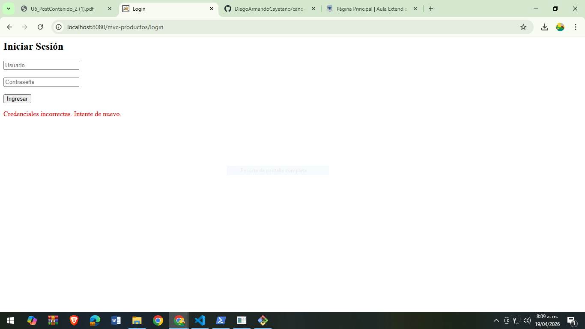
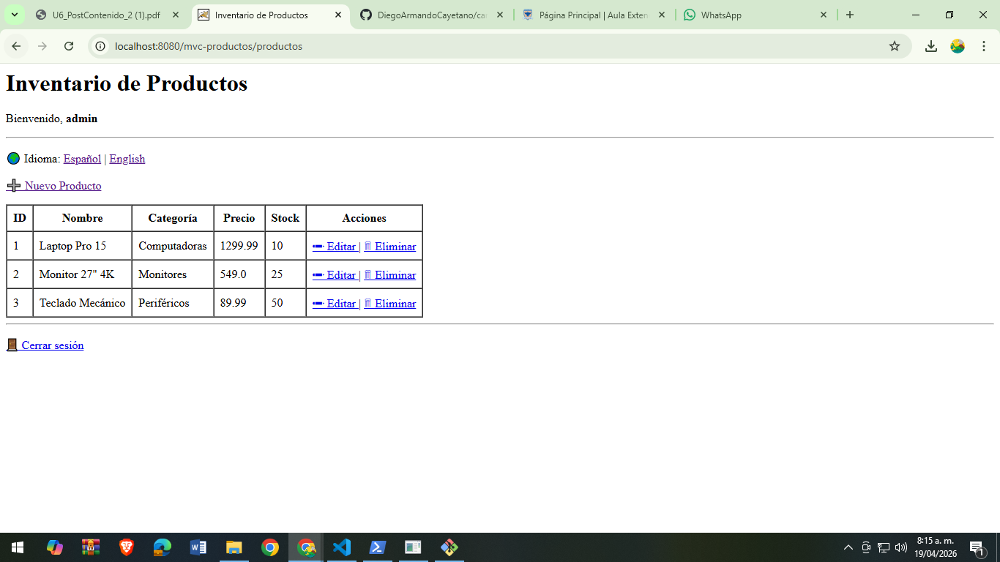
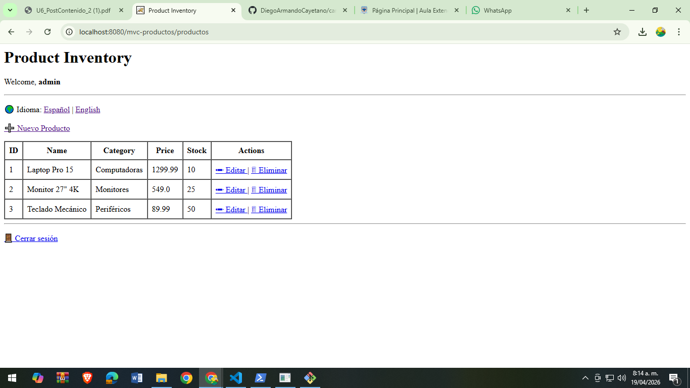
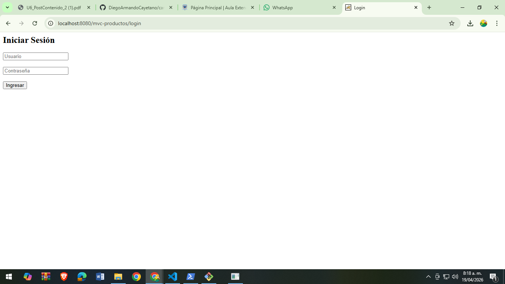

# 📦 MVC Productos - Post Contenido 2

## 📄 Descripción del proyecto
Este proyecto es una aplicación web desarrollada en Java utilizando el patrón MVC (Modelo–Vista–Controlador) con JSP y Servlets. Permite la gestión de productos con operaciones CRUD, autenticación de usuarios, validaciones en el servidor e internacionalización (i18n) en español e inglés.

---

## ⚙️ Qué se hizo
Se extendió el proyecto base del Post Contenido 1 incorporando:

- Sistema de autenticación de usuarios con HttpSession
- Protección de rutas del módulo de productos
- Validaciones de formularios en el servidor con retroalimentación en la vista
- Internacionalización (i18n) con ResourceBundle
- Selector de idioma persistente en sesión
- Manejo de sesiones y cierre de sesión seguro

---

## 🛠️ Cómo se hizo
El desarrollo se realizó utilizando:

- Java Servlets como controladores principales
- JSP con JSTL para la capa de vista
- Patrón MVC para separación de responsabilidades
- HttpSession para manejo de autenticación e idioma
- ResourceBundle para soporte de internacionalización
- Maven para la gestión del proyecto y construcción del WAR
- Apache Tomcat como servidor de despliegue

---

## 📸 Evidencias del funcionamiento

---

## 🔐 Login con validación

---

## 🌐 Idioma Español

---

## 🌐 Idioma Inglés

---

## 🚪 Cerrar sesión y redirección a login

## 👨‍💻 Autor
Diego Armando Cayetano Bautista Cano
